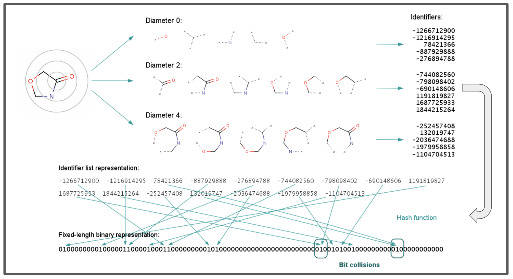

# Extended Connectivity Fingerprints (ECFP) Analysis Notebook

This Jupyter notebook is a guide and implementation for generating and understanding Extended Connectivity Fingerprints (ECFPs) for chemical compounds. ECFPs are a type of molecular fingerprint widely used in cheminformatics for tasks such as similarity searching, virtual screening, and compound classification.

This is the code repo for my blog post on ECFPs: https://medium.com/@musicalchemist/from-theory-to-code-a-deep-dive-into-molecular-extended-connectivity-fingerprints-ecfps-with-da1ed436925e

Image Refs:
- https://ursula.chem.yale.edu/~batista/classes/CHEM584/ci100050t.pdf
- https://docs.chemaxon.com/display/docs/extended-connectivity-fingerprint-ecfp.md

## Features

- **Custom ECFP Implementation:** A simplified Python implementation of ECFPs from scratch to illustrate the core concepts behind their generation.
- **ECFP Generation with RDKit:** Code demonstrations on how to compute ECFPs using the RDKit library.

## Requirements

- Python 3.x
- RDKit
- Jupyter Notebook or JupyterLab

To install RDKit, follow the instructions provided in the [RDKit documentation](https://www.rdkit.org/docs/Install.html). Ensure you have Jupyter Notebook or JupyterLab installed to view and run the notebook.

## Usage

Clone the repository or download the notebook file to your local machine. Open the notebook in Jupyter Notebook or JupyterLab and execute the cells sequentially to follow along with the analysis.
